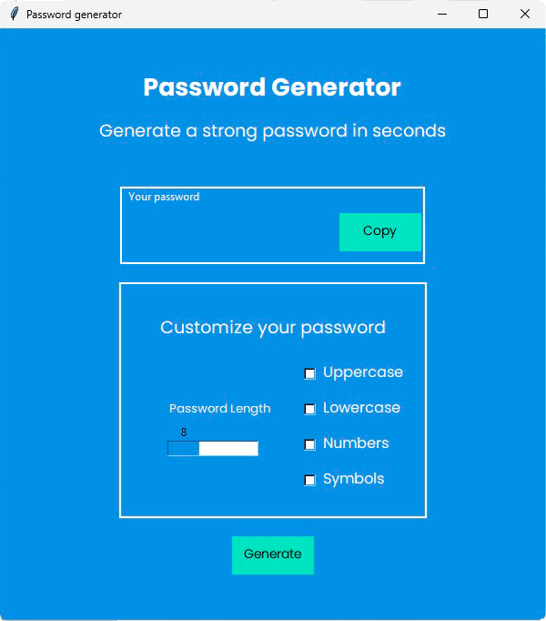

# 🇬🇧 - PASSWORD GENERATOR 🎙️

This project is a desktop application created with **Python** and **Tkinter** that generates **secure and customizable** passwords. It allows the user to choose the length of the password and select which types of characters to include, such as **uppercase** letters, **lowercase** letters, **numbers**, and **symbols**. Compatible with **Mac**, **Linux**, and **Windows**.





## 🚀 Why is this project useful?

This password generator is useful because it helps you create **strong and unique passwords** to protect your online accounts. Customizing the password allows you to tailor it to your specific needs, ensuring both **security** and **usability**. Additionally, it prevents the creation of weak or repetitive passwords.

---

## 🛠️ Requirements

Make sure you have the following requirements to run the application:

- **Python 3.x** installed. You can get it [here](https://www.python.org/downloads/).
- **Tkinter** (for the graphical interface). It is usually included with Python, but if you don't have it, you can install it with:
  ```bash
  sudo apt-get install python3-tk  # For Linux
  brew install python-tk  # For Mac
## 💻 How to start

- First, clone the repository.
    ```bash
  git clone https://github.com/damixtech/text_to_voice_app.git
<!-- - Then, install the dependencies.
  ```bash
  pip install -r requeriments.txt    -->

## 💾 How to run
- Running the code:
    - Run the code from your code editor (e.g., VSCode).
  
<!-- - Running the executable file (Dist folder)
    - Run the application from the executable file in the "dist" folder. It is compatible with operating systems such as **Linux**, **Mac**, and **Windows**. -->

## ✒️ How to use

- **Run the application**: Open the desktop application on your system.

- **Set the parameters**:

    - **Password length**: Adjust the slider to select the desired password length.

    - **Character types**: Check the options to include uppercase letters, lowercase letters, numbers, and/or symbols according to your preferences.

- **Generate the password**: Click the button to generate a new secure password with the selected settings.

- **Copy the password**: The generated password will appear in the interface, and you can easily copy it for use in your accounts.

## 🤝 Contributing
This repository is completely open to contributions and improvements.

1. Fork the repository.
2. Create a new branch for your contribution.
3. Make your changes and commit them.
4. Push your changes to GitHub.
5. Open a pull request on GitHub.
   
### I will be happy to see your contributions.
---
# 🇪🇸 - PASSWORD GENERATOR 🎙️

Este proyecto es una aplicación de escritorio creada con **Python** y **Tkinter** que genera contraseñas seguras y personalizadas. Permite al usuario elegir la longitud de la contraseña y seleccionar qué tipos de caracteres incluir, como mayúsculas, minúsculas, números y símbolos.Compatible con **Mac**, **Linux** y **Windows**.


## 🚀 ¿Por qué es útil este proyecto?

Este generador de contraseñas es útil porque te ayuda a crear contraseñas **fuertes y únicas** para proteger tus cuentas en línea. La personalización de la contraseña te permite ajustarla a tus **necesidades específicas**, garantizando tanto **seguridad** como **facilidad de uso**. Además, evita la creación de contraseñas débiles o repetitivas.

---

## 🛠️ Requisitos

Asegúrate de tener los siguientes requisitos para ejecutar la aplicación:

- **Python 3.x** instalado. Puedes obtenerlo [aquí](https://www.python.org/downloads/).
- **Tkinter** (para la interfaz gráfica). Generalmente se incluye con Python, pero si no lo tienes, puedes instalarlo con:
  ```bash
  sudo apt-get install python3-tk  # Para Linux
  brew install python-tk  # Para Mac

## 💻 Cómo empezar

- Lo primero que tendrás que hacer es **clonar** el repositorio.
    ```bash
  git clone https://github.com/damixtech/text_to_voice_app.git
<!-- - Después instala las dependencias.
  
    ```bash
  pip install -r requeriments.txt    -->

## 💾 Cómo ejecutar
- Ejecutando el código:
    - Ejecuta el código desde tu editor de código (Por ejemplo VSCode)
  
<!-- - Ejecutando el archivo ejecutable (Carpeta Dist)
    - Ejecuta la aplicación desde el archivo ejecutable de la carpeta **"dist"**. Es compatible con sistemas operativos como **Linux**, **Mac** y **Windows**. -->
  

## ✒️ Cómo usar
- **Ejecuta la aplicación**: Abre la aplicación de escritorio en tu sistema.

- **Configura los parámetros**:

  - **Longitud de la contraseña**: Ajusta el deslizador para seleccionar la longitud deseada de la contraseña.

  - **Tipos de caracteres**: Marca las opciones para incluir mayúsculas, minúsculas, números y/o símbolos, según tus preferencias.

- **Genera la contraseña**: Haz clic en el botón para generar una nueva contraseña segura con las configuraciones seleccionadas.

- **Copia la contraseña**: La contraseña generada aparecerá en la interfaz, y podrás copiarla fácilmente para usarla en tus cuentas.

## 🤝 Abierto a contribuciones
Repositorio totalmente abierto a contribuciones y mejoras.
1. Haz un **fork** del repositorio
2. Crea una **rama nueva** para tu contribución
3. Realiza los cambios y hac el **commit**
4. Sube tus cambios a **GitHub**
5. Abre una **pull request** en GitHub
   
#### ❤️ Estaré encantado de ver tus aportaciones.